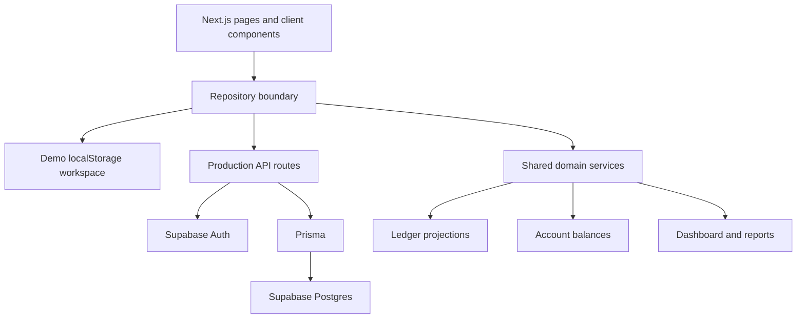

# SukoonOS Architecture

## Purpose

SukoonOS is a charity operations workspace for Sukoon Charity. The MVP must run locally in demo mode without credentials while staying ready for Supabase/PostgreSQL production mode.

## Runtime Modes

### Demo Mode

Demo mode is active when any of these are missing:

- `DATABASE_URL`
- `NEXT_PUBLIC_SUPABASE_URL`
- `NEXT_PUBLIC_SUPABASE_ANON_KEY`

Rules:

- Do not initialize Prisma.
- Do not initialize Supabase.
- Use local browser storage through a local repository layer.
- Migrate old local records without deleting them.
- Allow sample data and empty workspace flows.

### Production Mode

Production mode uses:

- Supabase Auth for identity.
- Prisma for relational Postgres access.
- Server-side route handlers for secure reads and writes.
- Activity logs for auditability.

Production mode is not yet fully tested because real credentials and migrations are not configured in this environment.

## Application Modules

### Finance

Entities:

- `FinanceAccount`: bank or cash account with currency and opening balance.
- `Donation`: income from a donor, optionally linked to a project and funding account.
- `Expense`: spending linked to category, project, funding account, payee/vendor, approval status, receipt, and notes.
- `Transfer`: movement between accounts that affects balances but not income/expense totals.
- `FinanceBudget`: budget by project/category/period/currency.
- `LedgerEntry`: chronological view of donations, expenses, transfers, refunds, fees, and adjustments.

Rules:

- Every financial movement creates ledger activity.
- Original amount, original currency, and historical PKR-per-USD exchange rate stay attached to each record.
- PKR and USD values derive from the record's saved historical rate, never from a newer rate.
- Account balances derive from opening balances plus transaction effects.
- CSV export remains available.
- PDF reporting should use stable report data payloads before adding any PDF rendering dependency.

### Projects

Entities:

- `Project`: type, location, status, dates, budgets, beneficiaries, staff, progress, notes.
- `ProjectTimelineItem`: dated milestone or update.
- `ProjectMediaPlaceholder`: future photo/video placeholder.
- `ProjectDocumentPlaceholder`: future document placeholder.
- `ProjectDonorUpdate`: donor-facing update and next-update reminder.
- `CompletionReport`: final impact and finance summary.

Project totals must derive from linked donations, expenses, transfers, budgets, and ledger activity.

### Donor CRM

Entities:

- `Donor`: contact profile, donor type, preferences, zakat preference, recurring status, notes, tax receipt status.
- `DonorUpdateHistory`: communication/update log.
- `DonorReminder`: next update due and reminder status.

Lifetime giving, last donation, and supported projects must derive from donations.

### Tasks And Approvals

Entities:

- `Task`: title, due date, priority, assignee, project link, and status.
- `Approval`: approval queue item for expenses, transfers, project updates, and reminders.

Approvals should reference the source record instead of copying financial data.

### Dashboard

Dashboard values must be projections over repository data:

- Donation totals in USD and PKR.
- Expense totals in USD and PKR.
- Balances by account.
- Active projects and over-budget projects.
- Monthly donations and expenses.
- Pending approvals.
- Overdue donor updates.
- Upcoming tasks.
- Recent ledger activity.

### Reports

Reports are query definitions plus generated result payloads. MVP reports:

- Monthly donations.
- Monthly expenses.
- Project income and spending.
- Expense category totals.
- Account balances.
- Transfer history.
- Donor giving.
- Missing receipts.
- Pending approvals.
- Dual-currency totals.
- Annual charity finance summary.

Reports must support search, date filters, project filters, currency display, and CSV export.

## Data Flow

## Local Data Strategy

The local workspace repository owns:

- Schema version.
- Sample-data flag.
- Expenses.
- Accounts.
- Budgets.
- Future donations, transfers, projects, donors, tasks, approvals, reports, settings, and audit log arrays.
- Browser-only transient notices for post-reload feedback after local imports or destructive workspace resets.

Legacy localStorage keys remain readable. The migration layer reads old keys, normalizes records, and writes a current workspace shape without deleting existing per-feature data.

Expense proof binaries remain outside localStorage in IndexedDB. Workspace JSON carries only validated metadata, while proof files move through a separate backup export/import flow.

## Security

- Demo mode is local-only and should be clearly labeled.
- Production writes require authenticated users and role checks.
- Settings and destructive actions are Admin-only until the expanded role model is migrated.
- Service-role Supabase keys must remain server-only and must never be committed.
- Audit log architecture records actor, action, entity, metadata, and timestamp in production.

## Future Production Migration

The current Prisma schema is a foundation, not the final MVP schema. Future non-destructive migrations should add:

- Dual-currency monetary fields and exchange rates.
- Ledger entry table or transaction table.
- Funding account references on expenses and donations.
- Cash account support or a generalized account type.
- Expanded project, donor, task, reminder, approval, and report fields.
- Role migration from `STAFF`/`VOLUNTEER` to `FINANCE`/`OPERATIONS`/`VIEWER`.

No destructive schema migration should happen without explicit approval and a data recovery plan.
